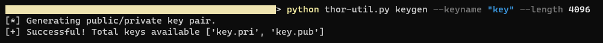
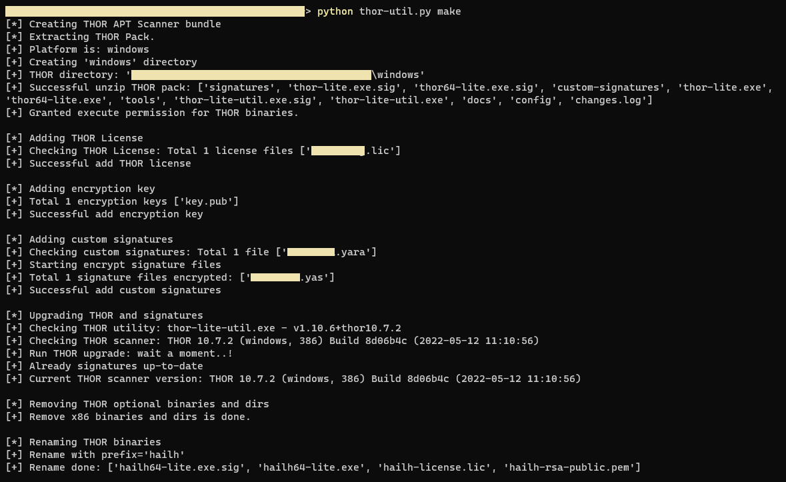
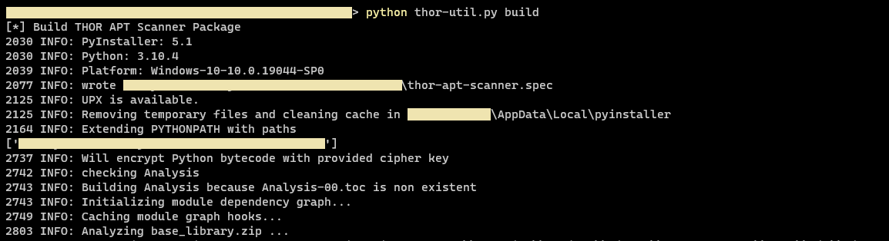
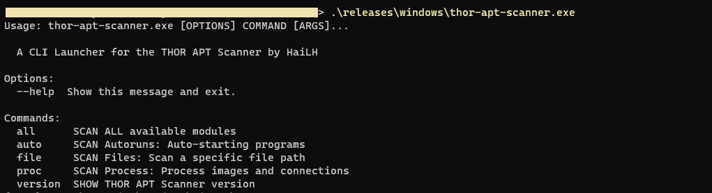

# THOR-Launcher

Host-base scanning tool using known IOCs and YARA rules to detect malware, apt attack. This tool is a launcher of the THOR-Lite APT Scanner.

## 1. Launcher features

- Scanning based on modules
- Cross-platform support: Windows, Linux, MacOSX
- Encryption IOCs, YARA rules before packing the tool
- Automatic update of IOCs and YARA rules from Nextron Systems GmbH
- You can add your own IOCs and YARA rules
- Multiple report export options: Text, HTML, JSON, CSV, etc..
- Customize configuration of CPU usage, memory, scan file size, etc..
- and more..!

## 2. Setting up environment

Download and install Python 3: https://www.python.org/downloads. Currently supported Python version 3.6 and above. To verify python installed:

```bash
# Windows
$ where python
  
# Linux or MacOSX
$ which python3
```

Create virtual python environment:

```bash
$ pip3 install virtualenv

# Windows
$ mkdir my-project & cd my-project
$ virtualenv -p c:\path\to\python.exe venv

# Linux or MacOSX
$ mkdir my-project && cd my-project
$ virtualenv -p /path/to/python3 venv
```

Active virtual python environment:

```bash
# Windows:
$ venv\Scripts\activate

# Linux or MacOS:
$ source venv/bin/activate
```

Clone THOR-Launcher:

```bash
$ git clone https://github.com/hailehong95/thor-launcher.git
```

Install dependencies packages:

```bash
(venv) $ pip install -r requirements.txt
```

## 3. Building THOR-Launcher

### 3.1. THOR Utility

A utility used to packing the **THOR-Lite** set into a single executable, convenient for distribution to clients when scanning.

```bash
(venv) $ python thor-util.py
Usage: thor-util.py [OPTIONS] COMMAND [ARGS]...

  A CLI Utility for THOR APT Scanner by HaiLH

Options:
  --help  Show this message and exit.

Commands:
  build      Build THOR APT Scanner package
  clean      Clean all temporary working files
  extract    Extract THOR packs
  keygen     RSA keys generator
  license    Add THOR license
  make       Create THOR APT Scanner bundle
  remove     Remove THOR optional binaries and dirs
  rename     Rename THOR binaries
  rsakey     Add encryption key
  signature  Add custom signatures
  update     Update signatures
  upgrade    Upgrade THOR and signatures
  version    Show Utility version
```

### 3.2. THOR-Launcher packing up steps

1. Get **THOR-Lite**: request to **Nextron Systems GmbH**: https://www.nextron-systems.com/thor-lite/download. Then wait for them to send the download link with the license key file via email. Download and save the THOR (**.zip**) to [**./thor_packs/**](./thor_packs) directory. Similarly, the license file (***.lic**) is saved in the [**./thor_license/**](./thor_license) directory

    - **YARA Rules**: Add your rules to the [**./signatures/**](./signatures) directory

    - **UPX Packer** (optional): Use **UPX** for compression as well as an extra step of protecting the executable. Download: https://github.com/upx/upx/releases and put in the corresponding directory in [**./packer/**](./packer)

2. Generate RSA key pair

    ```bash
    (venv) $ python thor-util.py keygen --keyname "key" --length 4096
    ```
    

3. Automatically create the **THOR** set

    ```bash
    (venv) $ python thor-util.py make
    ```
    

4. Packing **THOR APT Scanner**

    ```bash
    (venv) $ python thor-util.py build
    ```
    

5. Running THOR-Launcher

    ```bash
    $ thor-apt-scanner.exe
    ```
    

    - A **THOR-Launcher** will invoke the **THOR binaries** to scan. The final executable will have these binaries embedded and the iocs and yara rules included with the Python interpreter.
    - After scanning is completed, the report files will be encrypted and compressed into a ***.zip** file.

## 4. Systems that have been tested

- Microsoft Windows: 7, 8/8.1, 10, 2012, 2016, 2019
- Linux: Ubuntu 18.04 LTS, Ubuntu 20.04 LTS
- MacOSX: 10.16 (Big Sur)

## 5. Important

- THOR-Launcher as a project for learning purposes
- Do not use it for commercial purposes
- Please read the "THOR Lite End User License Agreement" inside Thor-Lite packs
